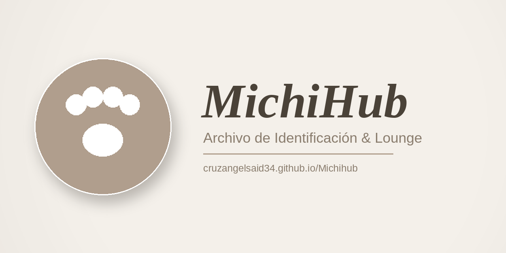
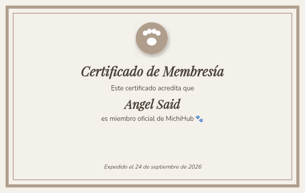

 

# michihub-cruzangelsaid34

### ¡Bienvenido, Angel Said! 🐾✨

Gracias por iniciar sesión en **MichiHub** con tu cuenta de GitHub. Este repositorio se creó automáticamente solo para ti el **24 de septiembre de 2026**, como parte de tu cuenta dentro del lounge.

MichiHub es un espacio con minijuegos, credenciales, radio en vivo, chat, almacenamiento en la nube y más, todo con un toque de gatitos 🐱.

> Este repo es tuyo: puedes usarlo, editarlo o borrarlo cuando quieras. Si cierras sesión en MichiHub, se elimina automáticamente y se vuelve a crear la próxima vez que entres.

---

### 🏅 Tu certificado de membresía

---

© 2026 MichiHub. Todos los derechos reservados.
